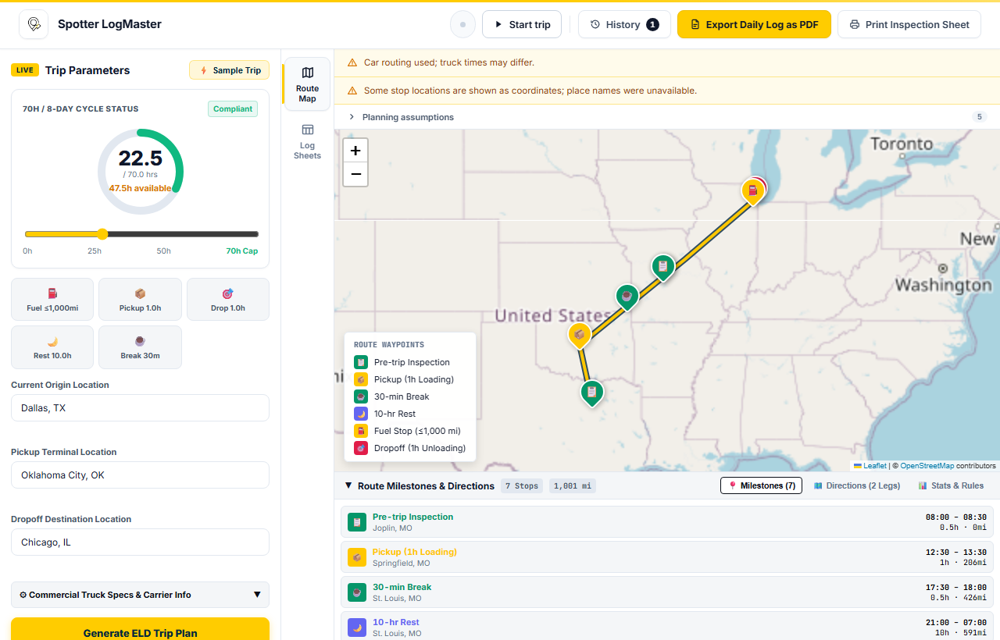
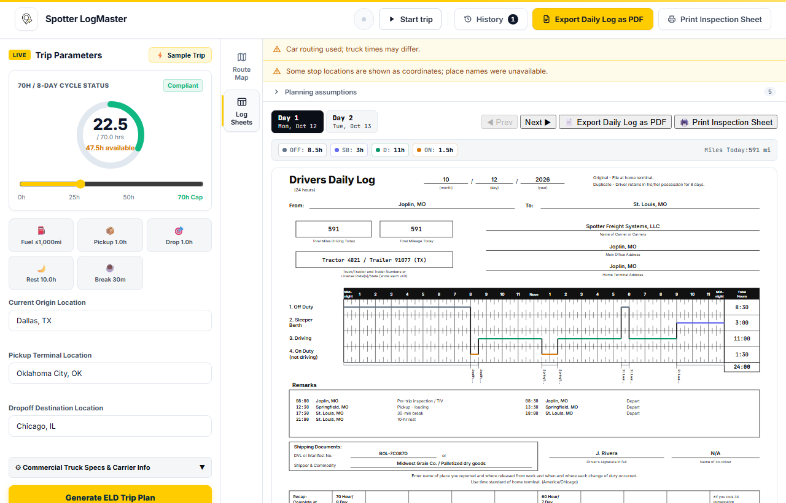
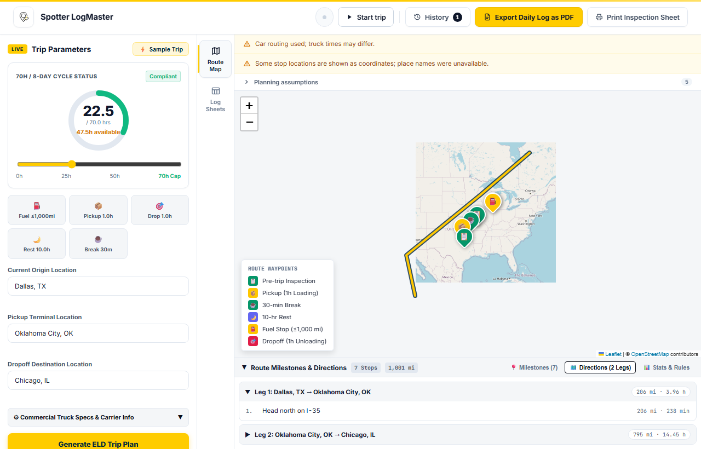

# ELD Trip Planner

Enter a truck trip and your cycle hours, and get a legal Hours of Service
schedule: every stop on a map and every daily log sheet already drawn.

Built to the requirements in
[`ELD Trip Planner — Software Requirements Specification.md`](./ELD%20Trip%20Planner%20—%20Software%20Requirements%20Specification.md).
Requirement IDs (`FR-HOS-02`, `BR-PLN-04`, …) are cited in the code next to the
logic that implements them.

> **Planning tool — projected logs, not an FMCSA-registered ELD.**
> It produces a *projected* record of duty status for planning. It captures no
> engine data, is not registered with FMCSA, and cannot transfer records to an
> inspector.

---

## What it looks like

A trip is entered on the left; the route, the stops the Hours of Service rules
forced, and the day's log sheets come back on the right.



Each stop is one the rules required — a 30-minute break at the eighth driving
hour, a fuel stop inside 1,000 miles, a 10-hour rest — and the drawer lists them
with the clock times and mileages they happen at. Anything the planner had to
work around, such as falling back to car routing when the truck profile is
unavailable, is stated above the map rather than left for the user to notice.



The log sheet is the pre-printed "Driver's Daily Log" form, drawn as vector SVG:
the 24-hour grid with quarter-hour ticks, the continuous duty line, remarks at
every status change, and the 70-hour/8-day recap. The same markup serves the
screen, the printer and the PDF export.



Screenshots are produced by `npm run screenshots` (see below) from a recorded
plan, so they stay current without a provider key.

---

## Setup

Five commands from a fresh clone (NFR-MNT-03):

```bash
# 1. Backend
cd backend && python -m venv .venv && .venv/Scripts/pip install -r requirements-dev.txt
cp .env.example .env            # then set ORS_API_KEY (optional, see below)
.venv/Scripts/python manage.py migrate --run-syncdb && .venv/Scripts/python manage.py createcachetable
.venv/Scripts/python manage.py runserver 8000

# 2. Frontend, in a second terminal
cd frontend && npm ci && npm run dev
```

On macOS or Linux use `.venv/bin/…` in place of `.venv/Scripts/…`.

Open <http://localhost:5173> and press **Try a sample trip**.

### Provider keys

`ORS_API_KEY` is a free [OpenRouteService](https://openrouteservice.org/dev/#/signup)
key. It is **optional for local development**: without it the app falls back to
Nominatim for geocoding and the public OSRM server for routing, and the UI says
so (FR-RTE-02). With it you get the truck (`driving-hgv`) profile, which is what
the schedule is meant to be based on.

Keys are read from the environment only and are never sent to the browser
(FR-SYS-02, INT-06); `scripts/scan-secrets.mjs` enforces that in CI.

---

## How it works

```
TripRequest
   │
   ├─ geocoding.py   labels → US coordinates, cached ≥ 24 h   (FR-GEO-01..04)
   ├─ routing.py     2 legs via ORS driving-hgv, OSRM fallback (FR-RTE-01..05)
   │
   ├─ hos/engine.py  pure (legs, cycle, start, config) → duty events
   │                                                      (FR-HOS-01..08)
   ├─ hos/logbuilder.py   duty events → one DailyLog per day  (FR-LOG-01..09)
   └─ planning.py    orchestrates the above into the API-01 response
```

### The scheduling engine

`backend/planner/hos/engine.py` is the heart of the app. It is a **pure
function** — no network, no database, no clock — so the same inputs always
produce byte-identical output (NFR-REL-01).

It drives each leg in chunks. A chunk is the shortest of the remaining
allowances:

| Allowance | Rule |
| --- | --- |
| 11 h driving in the duty period | BR-HOS-01 |
| 14 h since the period began | BR-HOS-02 |
| 8 h driving since the last ≥ 30 min interruption | BR-HOS-03 |
| 70 h cycle used | BR-HOS-04 |
| 1,000 miles since the last fuel stop | BR-PLN-01 |
| miles left in the leg | — |

So a chunk always ends at the first limit reached or at the end of the leg
(FR-HOS-02). Whichever limit bound it then selects the stop to insert, by the
BR-PLN-04 precedence: **34-hour restart → 10-hour rest → fuel → 30-minute
break**. Fuel is checked ahead of the break because a fuel stop falling due in
the same 15 minutes replaces it — it is a 30-minute on-duty interruption, so it
already satisfies BR-HOS-03.

Every limit is a whole number of 15-minute steps, so every event boundary lands
on `:00`, `:15`, `:30` or `:45` (FR-HOS-06). The final chunk of a leg rounds
**up**; a fuel-limited chunk rounds **down**, which is what puts the fuel stop
on the last 15-minute boundary at or before 1,000 miles (BR-PLN-05).

All tunable values live in one place, `hos/config.py` (BR-CFG). Tests override
them by constructing their own `HosConfig` — for example `pre_trip_min=0` for
the AC-01 fixture.

### The log sheet

`frontend/src/components/LogSheet.tsx` draws the FMCSA form as SVG on a
US-Letter-landscape viewBox (1056 × 816 at 96 dpi), so the same markup serves
the screen, the printer and the PDF with no rescaling. It follows the printed
paper form: the title block with month/day/year blanks, From/To, the mileage,
carrier, office and terminal boxes, the black-banded four-row grid with
quarter-hour ticks and a Total Hours column, one continuous stepped duty line,
place names written vertically under the grid, stationary brackets, the remarks
and shipping-document areas, and the 70-hour/8-day & 60-hour/7-day recap.

Each sheet carries an SVG `<desc>` listing the day's segments and totals, so it
is readable by a screen reader (NFR-ACC-02).

---

## API

| Endpoint | Purpose |
| --- | --- |
| `POST /api/trips/plan/` | Plan a trip; returns summary, route, stops, events, daily logs, notices |
| `GET /api/geocode/?q=` | Up to 5 US location suggestions |
| `GET /api/health/` | Build version and provider-key presence (boolean only) |

Timestamps are ISO 8601 with the log time zone's offset, distances in miles to
one decimal, hours to two (API-04). Both data endpoints are rate-limited to 30
requests per minute per IP (API-05). Errors always use one shape:

```json
{ "error": { "code": "route_not_found", "message": "…", "fields": {}, "request_id": "…" } }
```

Every response carries `X-Request-ID`, which the UI shows in error toasts
(NFR-OBS-02).

### Example

```bash
curl -X POST http://localhost:8000/api/trips/plan/ \
  -H 'Content-Type: application/json' \
  -d '{"current":{"label":"Dallas, TX","lat":32.7767,"lng":-96.797},
       "pickup":{"label":"Oklahoma City, OK","lat":35.4676,"lng":-97.5164},
       "dropoff":{"label":"Chicago, IL","lat":41.8781,"lng":-87.6298},
       "cycle_used_hr":22.5}'
```

---

## Tests

```bash
cd backend
.venv/Scripts/python -m pytest                 # 65 tests
.venv/Scripts/python -m pytest --cov=planner   # with coverage
.venv/Scripts/python -m ruff check .

cd ../frontend
npm run lint && npm run typecheck && npm run build
node ../scripts/check-bundle-size.mjs          # NFR-PERF-04 budget
node ../scripts/scan-secrets.mjs               # AC-10
```

All third-party HTTP is mocked, so the suite runs with no keys and no network.

| Acceptance criterion | Where |
| --- | --- |
| AC-01 reference schedule, day totals | `tests/test_engine.py::test_ac01_*` |
| AC-02 restart at cycle 65 and 70 | `tests/test_engine.py::test_ac02_*` |
| AC-03 500 random trips, no violations | `tests/test_invariants.py` (Hypothesis) |
| AC-04 150 mi trip, one sheet | `tests/test_engine.py::test_ac04_*` |
| AC-05 reference day, brackets, circled 10.5 | `tests/test_logbuilder.py::test_ac05_*` |
| AC-08 invalid inputs | `tests/test_api.py::test_plan_validation_errors` |
| AC-10 no key in bundle or repo | `scripts/scan-secrets.mjs` |

Coverage currently sits at **96%** for the engine and log builder (target 90%)
and **87%** for the backend overall (target 75%).

### Inspecting a drawn sheet without a browser

```bash
cd frontend
npm run render:sheets -- plan.json sheet-output   # plan.json = an API-01 response
```

This renders each day's log sheet to a standalone `.svg` file, which is handy
for checking grid geometry and flag placement directly.

### Screenshotting the app without a backend

```bash
cd frontend
npm run screenshots                     # every view -> frontend/screenshots/
npm run screenshots -- --view logs      # just one
npm run screenshots -- --width 900      # a narrower viewport
npm run screenshots -- --url https://…  # a live deployment's landing page
```

The script builds the app against a same-origin API, serves `dist/` and a
recorded plan (`scripts/fixtures/plan.json`) from one tiny server, then drives
headless Chrome or Edge through the UI — load the sample, submit it, open a
tab — and captures `empty`, `map`, `directions` and `logs`. No provider key, no
network and nothing to install; point `SCREENSHOT_BROWSER` at a binary if
neither browser is found automatically.

The fixture is a recording, so the screenshots show the UI, not the planner.
Replace it with any real API-01 response to screenshot a different trip.

---

## Deployment

| | Host | Notes |
| --- | --- | --- |
| Frontend | Vercel | `frontend/vercel.json`; set `VITE_API_URL` to the API origin |
| Backend | Render | `render.yaml` (DEP-04); gunicorn + whitenoise, Python 3.12 |

Required backend variables (DEP-01): `SECRET_KEY`, `DEBUG`, `ALLOWED_HOSTS`,
`CORS_ALLOWED_ORIGINS`, `ORS_API_KEY`, `NOMINATIM_USER_AGENT`.

Set `CORS_ALLOWED_ORIGINS` to the deployed frontend origin once it exists —
until then the backend rejects the browser's requests (API-06). The free Render
tier sleeps when idle, so the first request after a pause can take up to a
minute; the UI says so after 5 seconds of waiting (FR-UI-08).

---

## Assumptions

Taken from the brief and FMCSA's *Interstate Truck Driver's Guide to Hours of
Service*; the app lists them in an Assumptions panel at runtime (FR-UI-07).

- Property-carrying driver on the 70-hour / 8-day cycle, no adverse conditions.
- The driver starts fresh (≥ 10 hours off). Cycle used stays fixed for the trip
  except at a 34-hour restart — no hours roll off, because the input is a single
  total rather than an eight-day history (BR-PLN-03).
- Pickup and dropoff are 60 minutes on duty each; pre-trip inspection is 30
  minutes at the start and after every 10-hour rest and 34-hour restart; post-trip
  is 0 by default (BR-PLN-02).
- Fuel at least every 1,000 miles, 30 minutes on duty (BR-PLN-01).
- Logs use the current location's time zone. 10-hour rests are logged sleeper
  berth; breaks, restarts and time outside the trip are logged off duty (BR-PLN-06).
- The provider's leg duration stands in for truck driving time; per-chunk miles
  come from that average speed (BR-PLN-08).

### Out of scope

User accounts, stored trips, split sleeper-berth periods, the 60-hour / 7-day
cycle, adverse-conditions and short-haul exceptions, passenger-carrying rules,
and non-US trips.

### Known deviations from the SRS

- **AC-05 remark count.** AC-05 quotes "4 remarks" for the reference day, which
  is the number of *stops*. FR-LOG-06 is the normative rule — one remark per
  *change of duty status* — and for a day with four stationary brackets that
  yields nine remarks. The builder follows FR-LOG-06;
  `test_ac05_remark_per_duty_status_change` documents the difference.
- **A day's driving total can exceed 11 hours.** When a 10-hour rest ends
  mid-afternoon, one calendar day can contain the tail of one duty period and
  the start of the next. BR-HOS-01 caps driving *per duty period*, not per
  calendar day, so a sheet may legitimately show more than 11 driving hours.
- **Visual review of the drawn sheets (AC-06)** was done by rendering them to
  SVG and checking geometry programmatically, not with Playwright screenshots.
  The Playwright pass is still outstanding.

---

## Attribution

Map data and tiles © [OpenStreetMap](https://www.openstreetmap.org/copyright)
contributors · routing and
geocoding by [OpenRouteService](https://openrouteservice.org/) · time zones via
[`timezonefinder`](https://github.com/jannikmi/timezonefinder).
